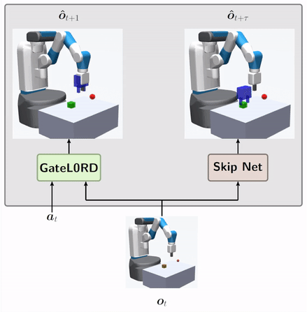
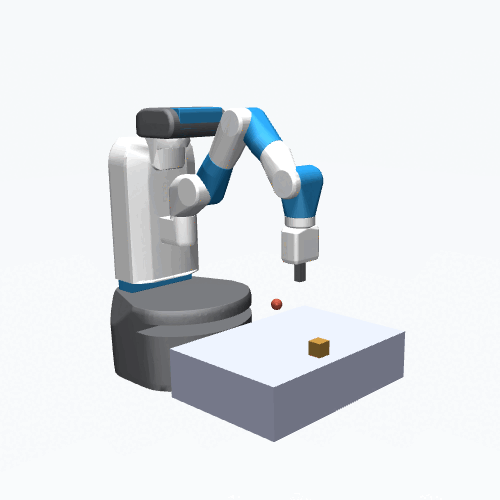
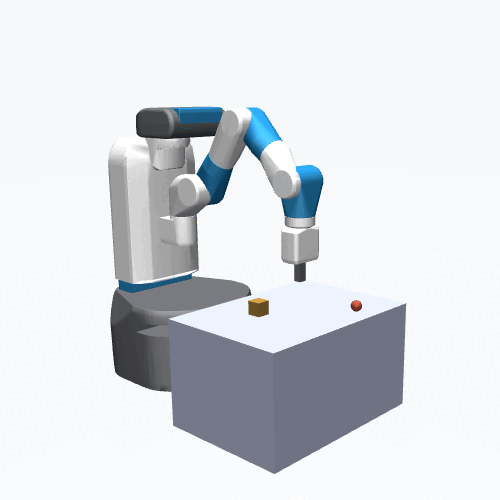
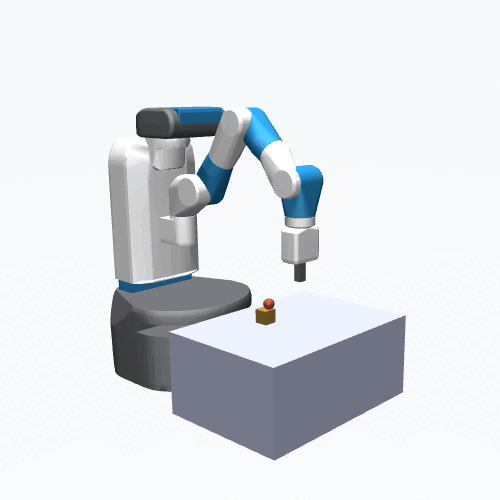
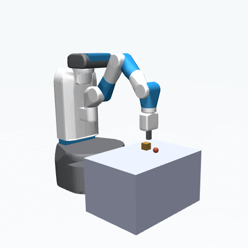

# HierarchicalGateL0RD: Developing hierarchical anticipations via neural network-based event segmentation
Source code for our 2022 ICDL paper ["Developing hierarchical anticipations via neural network-based event segmentation"](https://arxiv.org/abs/2206.02042).
<p align="center">

</p>

## Abstract

Humans can make predictions on various time scales and hierarchical levels. Thereby, the learning of event encodings seems to play a crucial role. In this work we model the development of hierarchical predictions via autonomously learned latent event codes. We present a hierarchical recurrent neural network architecture, whose inductive learning biases foster the development of sparsely changing latent state that compress sensorimotor sequences. A higher level network learns to predict the situations in which the latent states tend to change. Using a simulated robotic manipulator, we demonstrate that the system (i) learns latent states that accurately reflect the event structure of the data, (ii) develops meaningful temporal abstract predictions on the higher level, and (iii) generates goal-anticipatory behavior similar to gaze behavior found in eye-tracking studies with infants. The architecture offers a step towards the autonomous learning of compressed hierarchical encodings of gathered experiences and the exploitation of these encodings to generate adaptive behavior. 


## Data

We provide two types of sequences, **scripted** or **APEX**, downloadable [here](https://osf.io/4der6/).

### Scripted
Here the motor commands are scripted with some motor noise added. There are 3 different types of event sequences 

  

- **grasp**: Gripper moves to object, closes its fingers, and lifts the object to the goal position.
- **point**: Gripper moves to goal position.
- **stretch**: Arm repeatedly performs same, randomly generated motor command.

Scripted sequences use the simulator with varying table height. 


### APEX
Motor commands are generated by the policy-guided model-predictive control method [APEX](https://martius-lab.github.io/APEX/).
There are two types of sequences:

  

- **full**: Contains any type of sequence discovered by APEX, including highly creative ways to interact with the object.
- **grasp**: Filtered sequences to only include ones where the object is reached, fully grasped, and lifted to the goal without dropping it.

If you use APEX sequences please cite the [original publication](https://al.is.mpg.de/publications/pinneri2021-strong-policies).


## Usage
There are three different main files to (1.) train the forward-inverse model, (2.) train the skip network, (3.) run the attention selection /gaze experiments. The settings files for all experiments of the paper are provided in `settings/FPP/`

**Train the forward-inverse model**:

`python3 main_train_FIM.py -config settings/FPP/exp1_FPP_FIM_events.yaml`

**Train the skip network** (after training the forward-inverse model):

`python3 main_train_skip.py -config settings/FPP/exp2_FPP_skip_events.yaml`

**Gaze experiments** (after training the forward-inverse model and skip networks with gaze, i.e. exp4 configs)

`python3 main_gaze_experiments.py -config settings/FPP/exp4_gaze_experiments.yaml`

Optionally modify the `.yaml` files for different hyperamateres (e.g., different lambda values or RNN types)


## Bibtex

```
@inproceedings{gumbsch2022,
  title={Developing hierarchical anticipations via neural network-based event segmentation},
  author={Gumbsch, Christian and Adam, Maurits and Elsner, Birgit and Martius, Georg and Butz, Martin V},
  booktitle={2022 IEEE International Conference on Development and Learning (ICDL)},
  year={2022},
  organization={IEEE}
}

```
